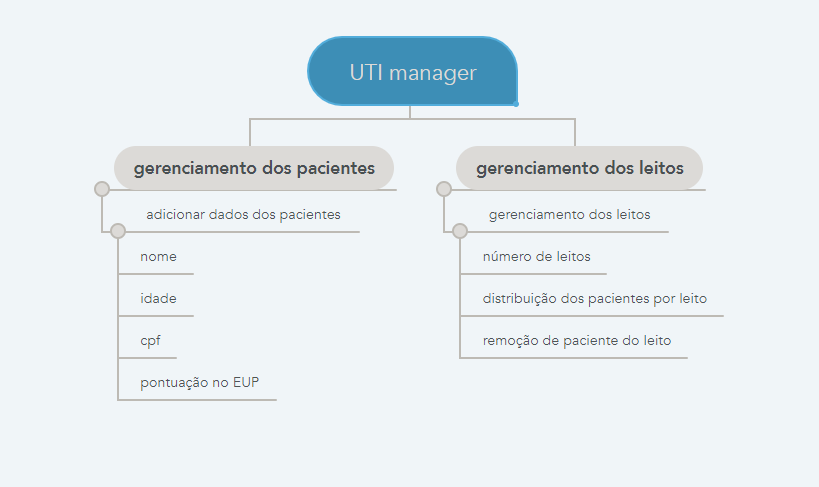

# UTI-Manager
***

## O que é? 

O _**UTI Manager**_ é um organizador de leitos para Unidade de Terapia Intensiva (UTI), que se baseia principalmente nas [recomendações](https://www.cremepe.org.br/wp-content/uploads/2020/04/RECOMENDAÇÃO-CREMEPE-Nº-05_v.final_.pdf) fornecidas pelo Conselho Regional de Medicina de Pernambuco (CREMEPE) e também na [Calculadora do Escore Unificado para Priorização em Unidades de Terapia Intensiva - EUP-UTI](http://cremepe.org.br/portal2015/calculadoraeup/), igualmente disponibilizada pela CREMEPE. 

## Pra que serve? 

O programa foi pensado para auxiliar na tomada de decisão de profissionais da saúde, em relação a ocupação de leitos de UTI.

### Escore Unificado para Priorização (EUP)

O _EUP_ é composto por 3 grupos de informações, que são:
* Previsão de sobrevivência a curto prazo
  * Sequential Organ Failure Assessment (**SOFA**) - simplificado
* Previsão de sobrevivência a longo prazo 
  * Indice de comorbidades (**ICC**) 
  * Clinical Frailt Scale (**CFS**)
* Previsão de sobrevivência global e de resposta terapeutica 
  * Karnofsky Performance Status (**KPS**) - adaptado

**OBS**: o CFS só é considerado para pacientes com mais de 60 anos. 

### Como a pontuação EUP é calculada? 

Cada grupo de informações tem seus próprios critérios para pontuação, depois de preenchidos com os dados do paciente é feita uma primeira verificação de maneira individual. Dessa forma, obtemos as pontuações do SOFA, ICC, CFS (para pacientes com mais de 60 anos) e KPS. Por últmo é utilizada e seguinte formula para calcular a pontuação EUP do paciente.   

#### 1 - *Previsão de sobrevivência a curto prazo*

 Pontuação SOFA - simplificado | Pontuação EUP
 :--: | :--: 
 Menor que 6 | +1
 Entre 6 e 9 | +2
 Entre 10 e 12 | +3
 Maior que 12 | +4
#### 2 - *Previsão de sobrevivência a longo prazo*
 Pontuação ICC | CFS | Pontuação EUP
 :--: | :--: | :--: 
 Igual a 0 ou 1| Menor que 4 | +1
 Igual a 2 |Igual a 4| +2
 Entre 3 e 5 |Igual a 5 ou 6| +3
 Maior que 5 |Igual a 7 ou 8| +4
#### 3 - *Previsão de sobrevivência global e de resposta terapêutica*
 Estado do paciente | Porcentagem KPS - adaptado | Pontuação EUP
 :--: | :--: | :--: 
 Com ou sem doença crônica, consegue trabalhar normalmente| 100% | +1
 Com doença crônica, consegue trabalhar apesar de ter sintomas |80-90%| +2
 Não consegue trabalhar mas mantém hobbies e autocuidado |50-60-70%| +3
 É incapaz de cuidar de si mesmo|10-20-30-40%| +4

## Estrutura básica do programa
O programa divide-se em duas partes, como mostra o diagrama a seguir.

 

**Gerenciamento dos pacientes**: contem as funções responsáveis por receber dados dos pacientes e fazer cálculos da pontuação EUP.

**Gerenciamento dos leitos**: baseado na pontuação dos pacientes organiza os leitos e filas, porém, a decisão final sempre é tomada pelo usuário.

## Como usar 

Ao iniciar o programa será apresentado um menu:  

1. Inserção de paciente 
    * o usuário deve informar todos os dados do paciente. (Nome, CPF, idade, SOFA, ICC, CFS e KPS).
2. Listar Pacientes  
    * Serão listados todos os pacientes com pontuação EUP, nome e CPF. 
3. Busca de paciente (por CPF)
    * Ao informar um CPF que está cadastrado serão mostradas todas as informações do paciente  
    * É mostrado um menu com opções para modificar os dados do paciente.
4. Listar pacientes em leito  
    * todos os pacientes cadastrados e posicionados em algum leito são listados. 
5. Remover paciente de leito  
    
6. Adicionar paciente a leito  
7. Mudar quantidade máxima de  leitos  
    * O usuário informa a quantidade de leitos de UTI disponíveis.  
0. Sair e Salvar
    * O programa é encerrado e todos os dados são salvos em um arquivo, para consultas futuras.  

INTEGRANTRES: Andre, Artur, Joao Paulo e Wellyngton.